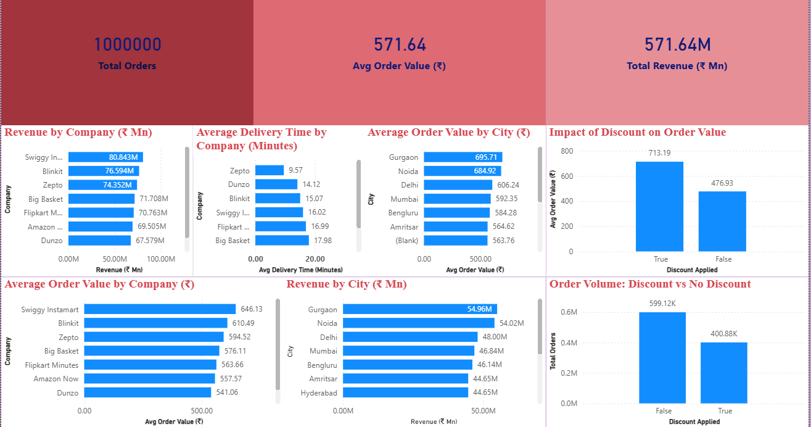

# Quick Commerce Business Performance Analysis

End-to-end **SQL + Power BI** project analyzing a Quick Commerce dataset with 1 million orders to uncover insights on revenue, delivery performance, city-wise demand, and discount impact.

---

## 📊 Dashboard Preview

### Full Dashboard


### Company & City Insights


---

## 🎯 Business Objectives

- Analyze overall business performance using key KPIs
- Compare revenue, order value, and delivery efficiency across companies
- Understand geographic demand and city-wise spending patterns
- Measure the impact of discounts on order volume and basket size

---

## 🧱 Dataset Overview

- Total Orders: **1,000,000**
- Multiple Quick Commerce platforms
- City-level and order-level attributes
- Mixed raw data requiring cleaning and type correction

---

## 🛠️ Tools & Technologies Used

- **Microsoft SQL Server**
  - Data ingestion (BULK INSERT)
  - Data cleaning & transformation
  - KPI analysis
  - Advanced SQL (CTEs, Window Functions)
- **Power BI**
  - Interactive dashboard
  - Business-focused visualizations
- **GitHub**
  - Version control
  - Project documentation

---

## 🧹 Data Cleaning Highlights (SQL)

- Converted raw text fields into proper numeric types
- Handled missing values logically (no fake imputation)
- Fixed decimal-to-integer issues (e.g., Items Count)
- Preserved data integrity using `TRY_CAST`
- Created separate **raw** and **clean** tables (industry practice)

---

## 📈 Key Insights

- **Average Order Value (AOV):** ₹571.64
- **Top Revenue Platform:** Swiggy Instamart
- **Fastest Delivery:** Zepto
- **Highest AOV Cities:** Gurgaon, Noida
- **Discount Impact:**  
  Discounted orders have ~50% higher AOV than non-discounted orders
- **Market Structure:**  
  Top 3 platforms contribute ~40% of total revenue, indicating healthy competition

---

## 📂 Project Structure

```text
quick-commerce-sql-powerbi-analysis/
│
├── sql/
│   ├── 01_create_tables.sql
│   ├── 02_data_cleaning.sql
│   ├── 03_kpi_analysis.sql
│   └── 04_advanced_sql.sql
│
├── dashboard/
│   ├── Quick_Commerce_PowerBI_Dashboard.pbix
│   └── screenshots/
│       ├── dashboard_overview.png
│       └── company_city_insights.png
│
└── README.md